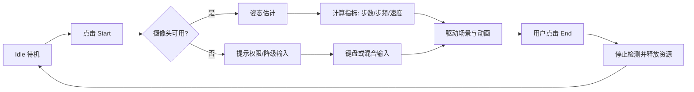

# VibeSports — Business Logic Map

## 产品概述

VibeSports 是一款面向桌面场景的 macOS 原生运动游戏：用户在等待开发任务执行时，可以快速开始一段“摄像头驱动的跑步会话”，通过身体动作驱动第三人称场景前进与转向。

目标用户：
- 长时间在电脑前工作的开发者/知识工作者
- 需要短时、低门槛运动打断久坐的人群

核心体验：
- 一键开始会话
- 动作被实时识别并转成游戏内运动反馈
- 会话结束后立即回到工作状态

输入与输出：
- 输入：摄像头视频帧、用户动作（含头部偏转）、可选键盘输入
- 输出：实时运动指标（步数/步频/速度/动作质量）与场景反馈（角色移动/转向/动画）

## 核心业务能力（Capabilities）

### 1) 会话启动与结束
- 用户价值：快速进入/退出运动状态，不打断主任务节奏
- 触发方式：用户点击开始或结束
- 输入：用户操作、摄像头权限状态
- 输出：会话状态切换（Idle/Running/Stopped）
- 关键边界与失败方式：未授权摄像头时无法进入 Running，用户会看到权限提示

### 2) 姿态识别与动作信号提取
- 用户价值：让“真实动作”成为游戏输入
- 触发方式：会话进入 Running 后持续处理帧
- 输入：摄像头帧
- 输出：姿态估计结果（可用/不可用）与基础动作信号
- 关键边界与失败方式：低光、遮挡、出画会导致姿态丢失，表现为输入衰减或暂停
  - 可观测性：可通过调试叠层查看关键关节的置信度与“稳定化后是否输出”，用于定位是“Vision 未输出”还是“阈值/稳定器过滤”

### 3) 跑步指标计算
- 用户价值：把原始姿态转成可理解的运动反馈
- 触发方式：每次姿态更新
- 输入：姿态信号、历史窗口
- 输出：步数、步频、速度、动作质量、近距离模式判定
- 关键边界与失败方式：异常动作会降低质量分，指标可能短时波动

### 4) 场景驱动与沉浸反馈
- 用户价值：动作与视觉反馈同步，形成“动起来”的即时奖励
- 触发方式：指标更新后驱动渲染层
- 输入：速度/转向输入/朝向
- 输出：角色导航、相机跟随、动画混合、场景连续推进
- 关键边界与失败方式：输入不稳定时优先保证体验连续，允许短时平滑过渡

### 5) 控制方式兼容（相机/键盘/混合）
- 用户价值：在不同环境下都能保持可用性
- 触发方式：用户切换控制源或使用键盘
- 输入：头部偏转、键盘 WASD
- 输出：统一控制输入流
- 关键边界与失败方式：摄像头不可用时仍可用键盘进行联调与体验

### 6) 偏好与调试开关管理
- 用户价值：保留个人习惯，降低重复设置成本
- 触发方式：用户修改设置
- 输入：显示/镜像/稳定化/调试叠层等开关
- 输出：下次启动可复用的偏好状态
- 关键边界与失败方式：设置存储异常时回退到默认值，不阻断主流程

## 核心用户流程（User Journeys）

### Journey A：短时运动闭环（主流程）
1. 用户在工作间隙打开应用并点击开始。
2. 系统检查并使用摄像头输入。
3. 姿态被持续估计并转为运动指标。
4. 场景按速度与转向实时响应，用户获得即时反馈。
5. 用户点击结束，会话停止并释放资源。

### Journey B：摄像头受限时的替代流程
1. 用户开始会话但摄像头不可用或不稳定。
2. 系统提示状态，同时允许键盘/混合输入。
3. 用户仍可完成短时运动或联调流程。
4. 会话结束后返回待机。

### Journey C：个性化调整流程
1. 用户打开调试或设置项（例如镜像、姿态稳定化）。
2. 调整后立刻看到场景/输入反馈变化。
3. 偏好保存并在后续会话复用。

## 业务流程图（Mermaid）

## 业务规则与约束（Rules & Constraints）

- 会话状态必须遵循 Idle/Running/Stopped，结束会话必须释放摄像头资源。
- 姿态不可用时不应阻塞主线程，应降级为可恢复状态。
- 场景速度与动画节奏应同源，避免“速度快慢与动画不一致”。
- 设置持久化属于用户偏好层，不应影响会话核心可用性。
- 默认面向短时运动场景，强调低启动成本与快速退出。

## 产物与可见结果（Outputs）

用户可见结果：
- 实时指标：步数、步频、速度、动作质量
- 实时反馈：角色移动、转向、动画变化、场景推进
- 状态反馈：权限提示、可用输入源、会话状态

会话级结果：
- 一次“开始到结束”的完整运动闭环
- 偏好设置在后续会话中延续

## 术语表（Glossary）

- 会话（Session）：一次从开始到结束的运动过程。
- 姿态估计（Pose Estimation）：从视频帧提取人体关键点。
- 动作质量（Movement Quality）：用于判断当前动作是否稳定有效的评分。
- 混合输入（Mixed Input）：摄像头输入与键盘输入共同作用。
- 场景推进（World Progression）：角色随输入在场景中持续前进和转向。

## 入口索引（Entry Index）

- `VibeSports/Views/VibeSportsApp.swift`
- `VibeSports/Views/RunnerGame/RunnerGameView.swift`
- `VibeSports/ViewModels/RunnerGameViewModel.swift`
- `VibeSports/Services/AppDependencies.swift`
- `VibeSports/Models/Running/RunningMetrics.swift`
