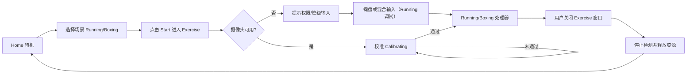

# VibeSports — Business Logic Map

## 产品概述

VibeSports 是一款面向桌面场景的 macOS 原生运动游戏：用户在等待开发任务执行时，可以快速开始一段“摄像头驱动的运动会话”，通过身体动作驱动游戏反馈。

目标用户：
- 长时间在电脑前工作的开发者/知识工作者
- 需要短时、低门槛运动打断久坐的人群

核心体验：
- 在 Home 窗口选择运动场景（Running / Boxing），并点击 Start 进入 Exercise 窗口
- Exercise 窗口开始前必须校准（Running：上半身；Boxing：上半身护脸姿势）
- 动作被实时识别并转成可观测的运动反馈与调试信号
- 会话结束后立即回到工作状态

输入与输出：
- 输入：摄像头视频帧、用户动作（姿态关键点）、可选键盘输入
- 输出：
  - Running：实时运动指标（步数/步频/速度/动作质量）与场景反馈（角色移动/转向/动画）
  - Boxing：拳法事件与计数 + 全屏摄像头预览与调试叠层

## 核心业务能力（Capabilities）

### 1) 运动场景选择与会话启动/结束
- 用户价值：快速进入/退出运动状态，不打断主任务节奏
- 触发方式：用户在 Home 选择场景并点击 Start 进入 Exercise；关闭 Exercise 窗口返回 Home
- 输入：用户操作、摄像头权限状态
- 输出：会话状态切换（Idle → Calibrating → Running）与窗口切换（Home ↔ Exercise）
- 关键边界与失败方式：
  - 未授权摄像头时无法进入 Running/Boxing，用户会看到权限提示
  - Home 不占用摄像头资源；摄像头仅在 Exercise 窗口启动

### 2) 姿态识别与动作信号提取
- 用户价值：让“真实动作”成为游戏输入
- 触发方式：会话开始后持续处理帧
- 输入：摄像头帧
- 输出：姿态估计结果（可用/不可用）与基础动作信号
- 关键边界与失败方式：低光、遮挡、出画会导致姿态丢失，表现为输入衰减或暂停
  - 可观测性：可通过调试叠层查看关键关节的置信度与“稳定化后是否输出”，用于定位是“Vision 未输出”还是“阈值/稳定器过滤”

### 3) 校准（Calibration）门禁（必须通过）
- 用户价值：让阈值具备尺度基准，减少“距离变化导致判定漂移”，并提供上手引导
- 触发方式：Start 后进入 Calibrating 状态
- 输入：Pose + 时间窗口
- 输出：进度（0~1）、失败原因（缺失关节/不稳定/太近/太远等）、baseline（例如肩宽尺度）
- 关键边界与失败方式：
  - Running：必须校准通过（上半身）才能开始驱动 3D 场景
  - Boxing：必须通过上半身护脸（guard）校准，且通过后才能开始识别拳法事件

### 4) Running：指标计算与 3D 场景驱动
- 用户价值：把姿态转成可理解的运动反馈并驱动沉浸场景
- 触发方式：校准通过后每次姿态更新
- 输入：姿态信号、历史窗口、校准 baseline
- 输出：步数、步频、速度、动作质量、近距离模式判定 + 统一 RunnerMotion
- 关键边界与失败方式：异常动作会降低质量分，指标可能短时波动；姿态丢失时指标衰减

### 5) Boxing：拳法事件识别与 Debug UI
- 用户价值：快速跑通“上半身入镜”的拳击体验，并提供可观测与可调参的调试面板
- 触发方式：校准通过后每次姿态更新
- 输入：姿态（可选稳定化后）+ 校准 baseline
- 输出：拳法事件（按左右手 + 类型）与计数；全屏摄像头预览与调试信息
- 关键边界与失败方式：出画/遮挡/置信度不足时事件不会触发，调试面板用于定位原因

### 6) 控制方式兼容（相机/键盘/混合）
- 用户价值：在不同环境下都能保持可用性
- 触发方式：用户切换控制源或使用键盘
- 输入：头部偏转、键盘 WASD
- 输出：统一控制输入流
- 关键边界与失败方式：摄像头不可用时仍可用键盘进行联调与体验

### 7) 偏好与调试开关管理
- 用户价值：保留个人习惯，降低重复设置成本
- 触发方式：用户修改设置
- 输入：显示/镜像/稳定化/调试叠层等开关
- 输出：下次启动可复用的偏好状态
- 关键边界与失败方式：设置存储异常时回退到默认值，不阻断主流程

## 核心用户流程（User Journeys）

### Journey A：Running（主流程）
1. 用户在 Home 选择 Running 并点击 Start 进入 Exercise。
2. Exercise 打开后进入校准态；校准通过后进入 Running。
3. 姿态被持续估计并转为运动指标与控制信号。
4. 3D 场景按速度与转向实时响应，用户获得即时反馈。
5. 用户关闭 Exercise 窗口，会话停止并释放资源。

### Journey B：Boxing（主流程）
1. 用户在 Home 选择 Boxing 并点击 Start 进入 Exercise。
2. Exercise 打开后进入上半身护脸校准；通过后开始识别拳法事件。
3. 用户在全屏摄像头预览里查看计数/事件与调试信息。
4. 关闭 Exercise 窗口结束会话并释放资源。

### Journey C：摄像头受限时的替代流程
1. 用户开始会话但摄像头不可用或不稳定。
2. 系统提示状态，同时允许键盘/混合输入。
3. 用户仍可完成短时运动或联调流程。
4. 会话结束后返回待机。

### Journey D：个性化调整流程
1. 用户打开调试或设置项（例如镜像、姿态稳定化）。
2. 调整后立刻看到场景/输入反馈变化。
3. 偏好保存并在后续会话复用。

## 业务流程图（Mermaid）

## 业务规则与约束（Rules & Constraints）

- 会话状态遵循 Idle → Calibrating → Running，结束会话必须释放摄像头资源。
- Running 必须校准通过（上半身）才能进入 Running。
- Boxing 必须校准通过（上半身护脸/guard）才能开始识别拳法事件。
- 姿态不可用时不应阻塞主线程，应降级为可恢复状态。
- 场景速度与动画节奏应同源，避免“速度快慢与动画不一致”。
- 设置持久化属于用户偏好层，不应影响会话核心可用性。
- 默认面向短时运动场景，强调低启动成本与快速退出。

## 产物与可见结果（Outputs）

用户可见结果：
- Running：步数、步频、速度、动作质量；角色移动、转向、动画变化、场景推进
- Boxing：拳法事件与计数；全屏摄像头预览；调试面板信息
- 状态反馈：权限提示、可用输入源、会话状态

会话级结果：
- 一次“开始到结束”的完整运动闭环
- 偏好设置在后续会话中延续

## 术语表（Glossary）

- 会话（Session）：一次从开始到结束的运动过程。
- 姿态估计（Pose Estimation）：从视频帧提取人体关键点。
- 动作质量（Movement Quality）：用于判断当前动作是否稳定有效的评分。
- 混合输入（Mixed Input）：摄像头输入与键盘输入共同作用。
- 场景推进（World Progression）：角色随输入在场景中持续前进和转向。
- 校准（Calibration）：开始前的姿态与尺度基准建立过程，未通过不可进入 Running/Boxing。

## 入口索引（Entry Index）

- `VibeSports/Views/VibeSportsApp.swift`
- `VibeSports/Views/Home/HomeView.swift`
- `VibeSports/Views/ExerciseWindow/ExerciseWindowView.swift`
- `VibeSports/ViewModels/Navigation/AppNavigationState.swift`
- `VibeSports/ViewModels/Running/RunningSessionViewModel.swift`
- `VibeSports/ViewModels/Boxing/BoxingSessionViewModel.swift`
